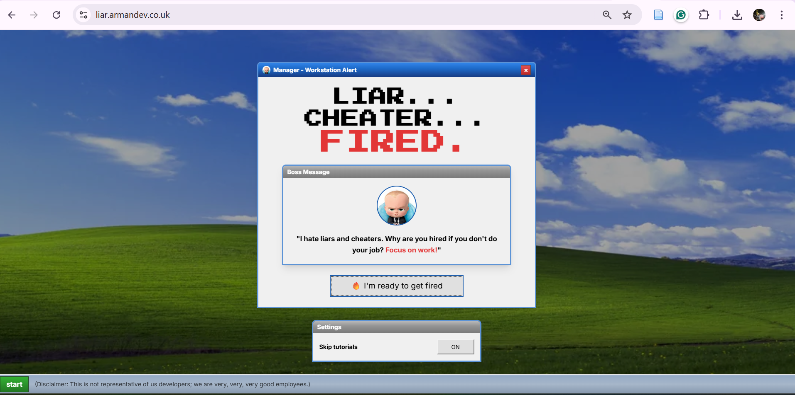

# 🔥 Liar, Cheater, Fired: The Corporate Escape

> **"The ultimate race to the bottom. Can you get fired before the 5:00 PM whistle?"**

## 💼 The Concept

As a team of **"Wonderful Magical Interns"** by day, we decided to spend RGUHack 26 exploring our dark mirrors.

In **Liar, Cheater, Fired**, the traditional "Escape Room" logic is flipped on its head. You aren't escaping a room; you are escaping a **career**. You play as a catastrophically bad employee. Your goal? **Get fired.** The ultimate "Fail State"? **A Promotion.** If you accidentally show competence, you’ll be locked in a corner office with a 60-hour work week. You must sabotage your way to freedom!

---

## 🧩 The "Work" (Puzzles)

To meet the **Sword Group** challenge requirements, we’ve built a suite of anti-productivity puzzles that test your ability to do absolutely nothing:

- **🔤 Corporate Yap Wordle:** Decipher the most annoying corporate buzzwords. Guess "Scope" or "Scrum" and you risk looking like a high-performer. Guess the "slacker" words to tank the meeting.
- **🧱 Jira Ticket Tetris:** The backlog is crazy! In sprint planning battle, your goal is to avoid being important. Every line of the backlog is being assigned to an individual, and if you aren't careful, you'll end up with a big project. Stay "Dead Weight" and keep your board clear to dodge the workload.
- **🏓 Marty Pong & Slacker Pacman:** Classic time-wasters dodging your Boss's Microsoft Teams pings. One hit and you’re stuck in a "Quick Sync" that lasts three hours. Then in Pacman Navigate the cubicle maze while running from unread emails.Stay alert, stay silent, stay unemployed!

---

## 👶 The Boss Baby (The Antagonist)

Meet your manager: **The Boss Baby**. He is micromanaging your every move.

- **The Goal:** Aggravate him until he hands you your P45.
- **The Risk:** If you solve his "Training Challenges" too efficiently, he might think you're "Management Material." Avoid the promotion at all costs!

---

## 🛠️ The "Unprofessional" Stack

We used a professional stack to build a very "professional" experience:

- **Framework:** React 18 + Vite
- **Styling:** Tailwind CSS and Lucide React for that sterile, soul-crushing office aesthetic.

---

## 🏗️ The "Hacker" Win

The biggest challenge was creating a game where **Winning = Losing** and **Losing = Winning**. We had to decouple traditional game rewards (points/levels) and replace them with disciplinary write-ups and HR complaints.

---

## 👥 The "Magical Interns" (The Team)

We are a group of placement students currently being "wonderful" in the real world, but "terrible" in this repo:

- **[Arman Shaikh]** - Chief Sabotage Officer
- **[Charis Drain]** - Head of Corporate Yap
- **[Himani Patney]** - Jira Ticket Architect
- **[Vidhi Jalan]** - Boss Baby Handler
- **[Lemar Tokham]** - Professional Email Ignorer 

---

### 🚀 How to Play

Navigate your wonderful self to: https://liar.armandev.co.uk/

### Run it locally

1. Install [bun](https://www.bun.com)
2. Run `bun install`
3. Run `bun dev`
